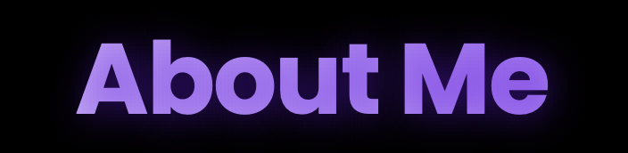

# Modern Portfolio Website

A dynamic and interactive portfolio website featuring 3D animations, responsive design, and modern UI elements. Built with vanilla JavaScript, Three.js, and custom CSS animations.



## ✨ Features

- **Interactive 3D Background** - Custom Three.js animation with dynamic particle system
- **Responsive Design** - Seamless experience across all device sizes
- **Modern UI/UX** - Clean, minimalist design with smooth animations
- **Dark Theme** - Elegant dark mode with purple accent colors
- **Project Showcase** - Interactive project cards with hover effects
- **Contact Form** - Integrated contact form with smooth animations
- **Skills Display** - Visual representation of technical skills
- **Downloadable Resume** - Easy access to resume download

## 🛠️ Technologies Used

- HTML5
- CSS3 (Custom properties, Flexbox, Grid)
- JavaScript (ES6+)
- Three.js for 3D animations
- Font Awesome for icons
- Google Fonts (Poppins)

## 🎯 Core Sections

1. **Home** - Featuring an interactive 3D background animation
2. **About** - Professional summary and technical skills
3. **Projects** - Showcase of featured work including:
   - Minimalist Interior Design Website
   - CareShare Charity Platform
   - Portfolio Website
4. **Contact** - Contact form and social media links

## 💻 Local Development

1. Clone the repository:
```bash
git clone https://github.com/MuhammadManda/portfolio-Website.git
```

2. Navigate to project directory:
```bash
cd portfolio-Website
```

3. Open `index.html` in your browser or use a local server:
```bash
# Using Python
python -m http.server 8000

# Using Node.js
npx http-server
```

## 📁 Project Structure

## ✨ Key Features Explained

### 3D Animation
- Custom particle system using Three.js
- Interactive mouse movement effects
- Responsive to scroll position
- Optimized performance with controlled particle count

### Responsive Design
- Mobile-first approach
- Breakpoints at 768px and 480px
- Fluid typography and spacing
- Optimized layouts for different screen sizes

### UI Components
- Animated project cards with hover effects
- Glowing button animations
- Smooth scrolling navigation
- Skills grid with icon animations

## 🔧 Customization

1. **Colors**: Modify CSS variables in `style.css`:
```css
:root {
  --primary-color: #ffffff;
  --secondary-color: #f0f0f0;
  --accent-color: #6b17e8;
  /* ... other color variables ... */
}
```

2. **3D Animation**: Adjust particle system in `main.js`:
```javascript
const particleCount = 800; // Modify for more/less particles
```

## 📱 Browser Support

- Chrome (latest)
- Firefox (latest)
- Safari (latest)
- Edge (latest)

## 📧 Contact

Muhammad Manda
- Email: mandamuhammad16@gmail.com
- LinkedIn: [Muhammad Manda](https://www.linkedin.com/in/muhammad-manda/)
- GitHub: [@MuhammadManda](https://github.com/MuhammadManda)


